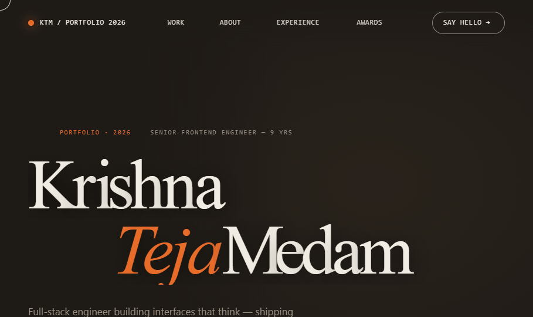

# Krishna Teja Medam — Portfolio

A high-fidelity personal portfolio built as a single-page HTML site, with a Three.js 3D character hero, GSAP scroll animations, and an editorial dark aesthetic.



---

## ✨ Features

- **Three.js hero** — rigged humanoid character (Xbot) with idle animation, orbiting geometric "ideas", a pulsing accent ring, and cursor-reactive body sway
- **GSAP animations** — character-by-character name reveal, scroll-triggered entrances for every section, project row fades, timeline staggers
- **Editorial typography** — Fraunces (display serif) + Inter (body) + JetBrains Mono (technical chrome), pulled live from Google Fonts
- **6 case studies** — each with an inline SVG mockup that reveals on hover and follows the cursor
- **Experience timeline** — 5 roles across 9 years, from junior to senior
- **Custom cursor** — follower dot + ring with hover states
- **In-page Tweaks panel** — swap accent color, background, grain, and cursor live (toggle from the toolbar)
- **Zero build step** — all dependencies load from CDN, so it works by opening `Portfolio.html` directly or deploying a folder to any static host

---

## 📐 Stack

| Layer | Tech |
|-------|------|
| Markup | HTML 5 |
| Styling | Hand-written CSS, no framework |
| Interactivity | React 18 + Babel (in-browser JSX) |
| 3D | Three.js r147 + GLTFLoader |
| Motion | GSAP 3.12 + ScrollTrigger |
| Fonts | Google Fonts (Fraunces, Inter, JetBrains Mono) |

---

## 📁 File structure

```
.
├── Portfolio.html        # Entry — rename to index.html for root hosting
├── portfolio.css         # All styles
├── preview.png           # README cover
└── src/
    ├── app.jsx           # Root React component + GSAP ScrollTrigger wiring
    ├── hero.jsx          # Three.js scene + GLTF character + hero layout
    ├── projects.jsx      # Project rows with hover-preview SVG mockups
    ├── sections.jsx      # About, Experience, Skills, Awards, Contact, Nav, Marquee
    ├── tweaks.jsx        # In-page tweak panel (accent/bg/grain/cursor)
    └── data.jsx          # Projects, experience, skills, awards content
```

---

## 🚀 Run locally

Just open `Portfolio.html` in a modern browser — or, for best results, serve the folder:

```bash
# Any static server will do
npx serve .
# or
python3 -m http.server 8000
```

Then visit `http://localhost:8000/Portfolio.html`.

---

## ☁️ Deploy to GitHub Pages

1. Rename `Portfolio.html` → `index.html` (so it loads at the root URL)
2. Push this folder to a GitHub repo
3. **Settings → Pages** → Source: `Deploy from a branch` → Branch: `main` / `/ (root)` → Save
4. Your site goes live at `https://<you>.github.io/<repo>/`

No build step required. No Node. No bundler. Just static files.

---

## 🎨 Customising

- **Accent color** — use the in-page Tweaks panel, or edit the `--accent` CSS variable in `portfolio.css`
- **Content** — edit `src/data.jsx` to update projects, experience, skills, awards
- **3D character** — swap the GLTF URL in `src/hero.jsx` (`const url = …`) for any public GLB file

---

## 📬 Contact

**Krishna Teja Medam** — Senior Frontend Engineer
📧 krishnatejam987@gmail.com
📱 +91 99 6626 9426
🏙 Hyderabad, IN · Remote

---

<sub>© 2026 Krishna Teja Medam. Design and code by yours truly.</sub>
